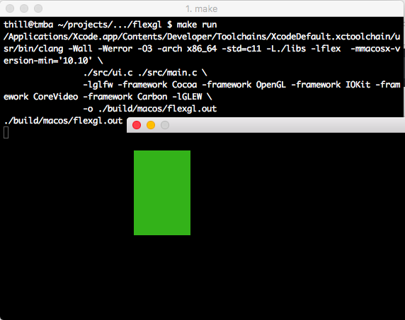

# `flexgl`

### Screenshots



### Information

flexgl uses Microsoft's MIT-licensed [flex](https://github.com/xamarin/flex) library.

### Running

```
make run
```

Hit `esc` at any time to close the window and abort execution.

### License

MIT
